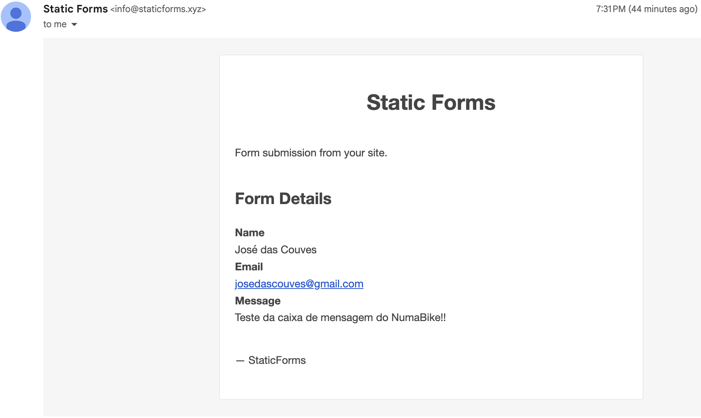

# NumaBike

O NumaBike é um projeto desenvolvido para fornecer dicas úteis para ciclistas, tanto para aqueles que estão iniciando no mundo do ciclismo quanto para os ciclistas mais experientes. O projeto é construído utilizando HTML5, CSS3 e JavaScript.

## Funcionalidades

O NumaBike oferece as seguintes funcionalidades:

- **Dicas para Ciclistas**: O projeto fornece uma lista de vídeos com dicas úteis para ciclistas, abrangendo desde manutenção básica da bicicleta até técnicas avançadas de pilotagem.

- **Reprodução de Vídeos**: Os usuários podem assistir aos vídeos diretamente na página, com a capacidade de selecionar um vídeo da lista de dicas.

- **Envio de email de contato**: Os usuários podem enviar uma mensagem adicionando seu nome, email e a mensagem. Essa mensagem chega na caixa de entrada do NumaBike. Utilizei o [Static Forms](https://www.staticforms.xyz/) para gerenciar o envio dos emails

## Tecnologias utilizadas

O projeto NumaBike foi desenvolvido utilizando as seguintes tecnologias:

- **HTML5**: Utilizado para estruturar o conteúdo da página.
- **CSS3**: Utilizado para estilizar a página e torná-la visualmente atraente.
- **JavaScript**: Utilizado para adicionar interatividade à página, como a reprodução de vídeos e a seleção de itens da lista.

## Autores

- [Thiago Lima](https://github.com/Thlimass) - Desenvolvedor principal
